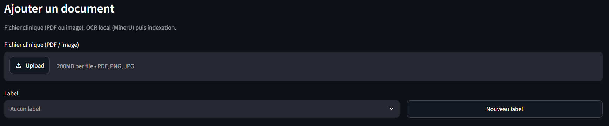
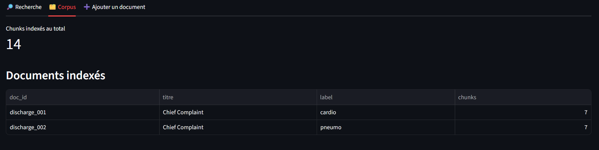
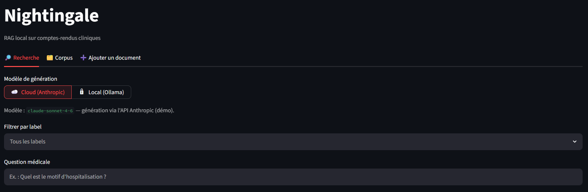
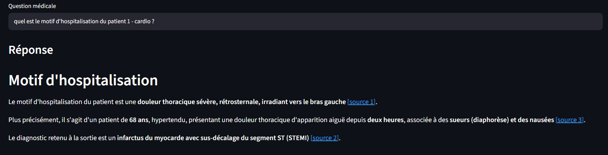
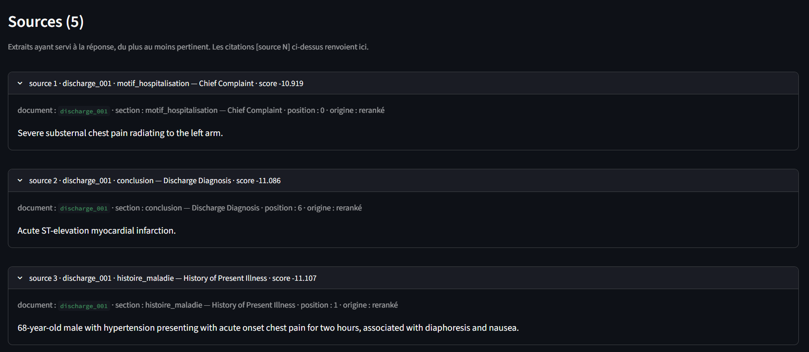

# Nightingale

<p align="center">
  
</p>

**Nightingale** — un moteur de recherche intelligent pour comptes-rendus
cliniques, qui tourne entièrement en local.

Vous déposez des lettres de sortie ou des CR médicaux (PDF, images), vous posez
une question en langage naturel, et l'outil retrouve les passages pertinents
puis rédige une réponse synthétique : toujours sourcée, sans jamais inventer.

Tout le traitement (lecture OCR des documents, recherche, indexation) se fait
sur la machine, sans qu'aucune donnée ne sorte : un choix pensé pour les
contraintes de confidentialité du secteur de la santé (HDS). La génération de la
réponse peut au choix passer par un modèle cloud (pour la démo) ou par un modèle
100 % local, activable d'un clic.

---

## Installation

Prérequis : Python 3.12, et — pour le mode 100 % local — [Ollama](https://ollama.com).

```bash
# 1. Environnement virtuel
python -m venv .venv && source .venv/bin/activate

# 2. Torch CPU (machine sans GPU) puis dépendances
pip install torch --index-url https://download.pytorch.org/whl/cpu
pip install -r requirements.txt

# 3. Configuration
cp .env.example .env
```

Choisissez **au moins un** backend de génération :

- **Cloud** (meilleure qualité, pour la démo) : renseignez `ANTHROPIC_API_KEY`
  dans `.env`.
- **Local** (aucune donnée ne sort) : installez Ollama et récupérez un modèle —
  `ollama pull llama3.2:1b`.

> L'OCR (MinerU) est local et ne demande aucune clé. Le fichier `.env` est ignoré
> par git : n'y committez jamais de clé.

---

## Prise en main

Lancez l'interface :

```bash
streamlit run app/streamlit_app.py
```

### 1. Ajoutez vos documents

Onglet **Ajouter un document** : glissez un PDF ou une image. La lecture (OCR
local) et l'indexation se font automatiquement.

<p align="center">
  
</p>

Vos documents indexés — et le nombre de passages (chunks) — sont visibles dans
l'onglet **Corpus**, où vous pouvez aussi les étiqueter ou les supprimer.

<p align="center">
  
</p>

### 2. Posez votre question

Onglet **Recherche** : choisissez le modèle de génération (☁️ **Cloud** ou 🔒
**Local**), filtrez éventuellement par label, puis tapez votre question en
langage naturel.

<p align="center">
  
</p>

### 3. Lisez la réponse sourcée

Nightingale retrouve les passages pertinents et rédige une réponse **ancrée
uniquement sur vos documents**. Chaque affirmation renvoie à un extrait via une
citation `[source N]` cliquable.

<p align="center">
  
</p>

Les sources sont listées sous la réponse, du plus au moins pertinent, avec le
document, la section clinique et le texte exact — pour tout vérifier.

<p align="center">
  
</p>

### En ligne de commande (optionnel)

```bash
python -m ingestion -v                 # OCR + parsing des PDF de data/raw/
python -m indexing --reset -v          # chunking + indexation
python -m llm "Quel est le motif d'hospitalisation ?"   # RAG complet
```

---

## Sous le capot

Le pipeline enchaîne cinq étapes, toutes locales sauf la génération cloud
optionnelle :

```
PDF / image  →  OCR local (MinerU)  →  chunking par section  →
index (embeddings e5 + BM25, ChromaDB)  →  recherche hybride (RRF + reranker)  →
réponse citée (Anthropic cloud ou Ollama local)
```

| Étape | Techno |
|-------|--------|
| OCR | MinerU (local, CPU) |
| Embeddings | `multilingual-e5-small` (local, CPU) |
| Index | ChromaDB (persisté sur disque) |
| Recherche | BM25 + vectoriel, fusion RRF, reranker `ms-marco-MiniLM-L6-v2` |
| Génération | Anthropic `claude-sonnet-4-6` (cloud) **ou** Ollama (local), commutable d'un clic |

La génération est découplée derrière une interface `LLMClient` : `llm/factory.py`
instancie le bon backend selon le provider choisi. Le retrieval étant déjà local,
choisir Ollama rend le pipeline **intégralement on-premise**.

Qualité du retrieval sur le jeu de démo (12 questions annotées, 2 lettres de
sortie) : **MRR ≈ 0.73**, **nDCG@5 ≈ 0.78** (`python -m evaluation
data/eval/questions.json --k 5 --id-field chunk`).

---

## Confidentialité (HDS)

- **OCR et recherche 100 % locaux** : aucun document, aucune donnée indexée ne
  quitte la machine.
- **Génération commutable** : le mode cloud (Anthropic) est le seul maillon
  externe, acceptable en démo car le corpus est fictif. Le mode local (Ollama)
  le supprime → pipeline entièrement on-premise.

**Données de démo** : lettres de sortie **synthétiques** (fictives) — aucun
patient réel. Le pipeline vise des comptes-rendus anonymisés de type MIMIC-IV.
Les répertoires `data/` sont ignorés par git ; aucun compte-rendu n'est versionné.
